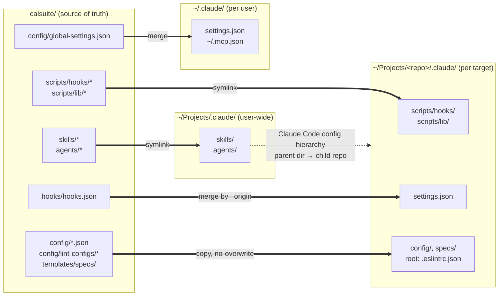

# calsuite

Personal Claude Code configuration — hooks, commands, scripts, plugins, skills, and agents.

**Version: 2.5**

## Getting started

Clone this repo and symlink or copy the relevant directories into your project's `.claude/` directory, or reference them from your global Claude Code settings.

```
hooks/       # Shell commands triggered by Claude Code events
commands/    # Custom slash commands
scripts/     # Standalone utility scripts + configure-claude installer
config/      # Global settings manifest + profiles.json
plugins/     # Claude Code plugins
skills/      # Custom skills (/configure-claude, /strategic-compact, /spec-interview, /update-docs, /context7, /guardian)
agents/      # Agent definitions (@context-loader, @doc-updater, @browser, @code-reviewer)
templates/   # Spec, doc, and changelog templates
```

## Distribution model

Calsuite is the single source of truth. Assets flow out to three tiers — each with a mechanism tuned to how the asset is meant to be edited downstream.



| Asset | Mechanism | Landing zone | Local override |
|---|---|---|---|
| Skills, agents | Symlink once into parent | `~/Projects/.claude/skills/`, `agents/` | `--only <skill>` / `--only-agents <name>` writes a per-target copy |
| Hook scripts, lib scripts | Symlink into each target | `.claude/scripts/` per target | `--copy` flag forces real copies |
| Hook config | Merge by `_origin: calsuite` tag | `.claude/settings.json` per target | Project hook entries without `_origin` are preserved |
| Configs, templates, lint, MCP | Copy (no-overwrite) / merge | `.claude/config/`, `.eslintrc.json`, `.claude/specs/`, `~/.claude/settings.json`, `~/.mcp.json` | Existing files are never touched |

**Why three tiers?** Skills and agents live once at the parent `~/Projects/.claude/` and every repo under it inherits them via Claude Code's config hierarchy — so editing a skill in calsuite propagates instantly, and no per-target copy can be accidentally clobbered on re-sync. Hook scripts need a path-stable `.claude/scripts/` inside each project, so they're symlinked per-target (still live, just scoped). Configs and templates are copied because projects are expected to diverge (e.g. a project's own ESLint overrides). `hooks.json` is a merge file, so entries are tagged `_origin: calsuite` to let `mergeHooks()` replace upstream entries while preserving project-local ones.

**Propagation.** The repo's `.git/hooks/post-commit` auto-runs `configure-claude.js --sync` whenever a commit touches `hooks/`, `skills/`, `agents/`, `scripts/`, or `config/`, so targets listed in `config/targets.json` pick up changes without manual intervention.

## Mono-repo Support

The installer auto-detects project type via `config/profiles.json`:
- **Signals** — file existence, package.json deps/fields, subdirectory presence
- **Profiles** — `base`, `typescript`, `python`, `frontend`, `backend`, `monorepo-root`
- Each profile specifies which plugins, skills, agents, and templates to install
- Mono-repos get per-workspace installation with workspace-specific profiles

```bash
# Install into a mono-repo with backend/ and frontend/
node scripts/configure-claude.js /path/to/monorepo
```

## Agents

- **`@context-loader`** — Reads all spec state, git history, and produces a prioritized briefing for the session
- **`@doc-updater`** — Detects changed workspaces, fans out parallel sub-agents to update docs, creates architecture diagrams via Excalidraw MCP, then updates root tracking files
- **`@browser`** — Browser automation via `agent-browser` CLI — screenshots, navigation, clicking, form filling, and visual verification
- **`@code-reviewer`** — Reviews staged git changes against CLAUDE.md conventions and codebase patterns; writes a review stamp on PASS to unlock the commit gate

## Spec-driven Development

When installed with the `monorepo-root` profile, the installer creates:
- `.claude/specs/` — templates for requirements, design, and tasks
- `SPECLOG.md` — tracks spec status across the project
- `CHANGELOG.md` — keep-a-changelog format
- `docs/` — documentation folder at root and each workspace

## MCP Servers

The installer auto-configures MCP servers defined in `config/global-settings.json`:
- **sequential-thinking** — structured reasoning via `@modelcontextprotocol/server-sequential-thinking` (stdio, runs locally)
- **excalidraw** — hand-drawn architecture diagrams via [excalidraw-mcp](https://github.com/excalidraw/excalidraw-mcp) (used by `@doc-updater`)
  - Default URL points to the Excalidraw team's Vercel deployment (`excalidraw-mcp-ashy.vercel.app`)
  - To self-host: clone the [repo](https://github.com/excalidraw/excalidraw-mcp), build, and update the `url` in `config/global-settings.json`
- **context7** — current, version-specific library documentation via [Context7](https://github.com/upstash/context7) (used by `/context7` skill, no API key required)

Servers are written to `~/.mcp.json` and enabled in `~/.claude/settings.local.json` automatically.

## Changelog

See [CHANGELOG.md](./CHANGELOG.md).
