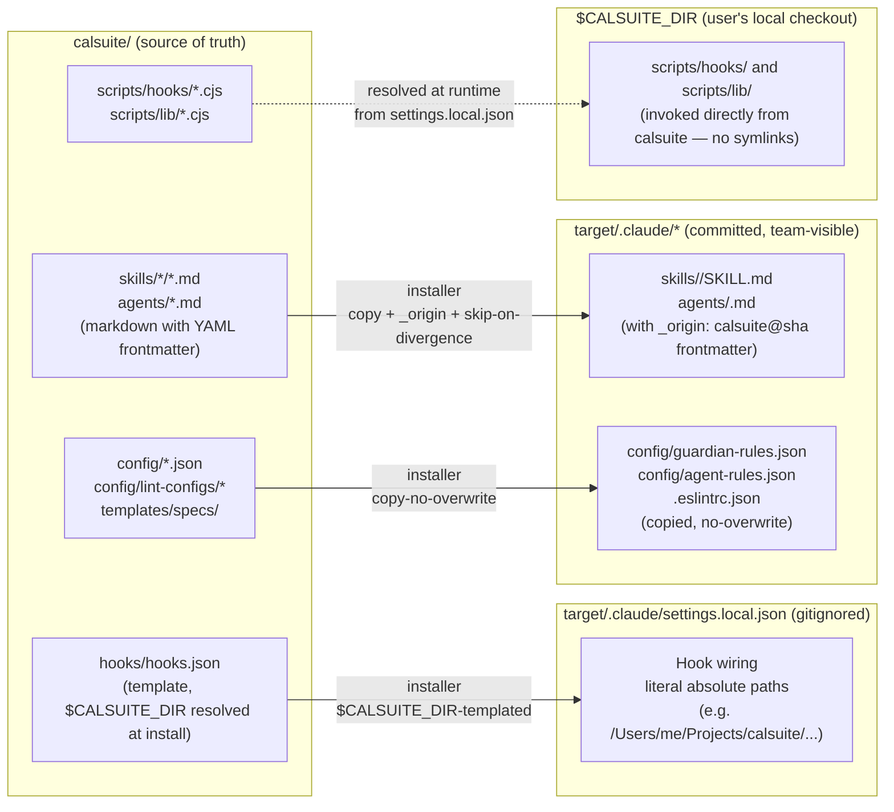

# Design: Personal Harness Distribution Refactor

## Context

Calsuite is a personal dotfiles-style config harness. Its assets (hooks, skills, agents, configs) are installed into per-user target repos under `~/Projects/`. The current installer conflates three distinct distribution problems into one mechanism, which leaks machine-specific paths into committed files and silently overwrites downstream edits.

Downstream review (verity, PR #453) surfaced the critical symptom: committing `.claude/settings.json` populated by calsuite produces 24 occurrences of `/Users/callumke/Projects/verity/.claude/...` absolute paths, breaking every other collaborator's checkout and CI. Earlier in the same conversation we also confirmed that the `copyDirSync`-based skill distribution unconditionally clobbered local target edits on every `--sync`.

## Goals

1. **Nothing calsuite writes into a target repo's tracked files should break another collaborator's checkout.** Machine-specific state (absolute paths, symlinks to calsuite, any personal tooling) lives in gitignored paths only.
2. **Shared content (skills, agents, review checklists) can still be committed and team-visible** — but the installer must never silently overwrite a target's local edits to that content.
3. **First-time and upgrading targets both work.** Targets onboarded before any given protocol change must migrate without data loss and without a manual big-bang command.

## Non-goals

- LLM-mediated sync. Mechanical sync is the baseline; `/reconcile-targets` (agentic) is a separate follow-up skill.
- Profile curation for skills. Every non-internal skill flows to every target; invocation-time descriptions govern what Claude actually uses.
- Supporting calsuite being checked out at arbitrary paths. We require it on the user's machine, but the location is configurable via `$CALSUITE_DIR` (default `~/Projects/calsuite`).

## Architecture

Three distribution tiers, each sized to the portability requirement of the asset it carries.



**Key shift from current state:**

| Asset | Current | New |
|---|---|---|
| Hook scripts | Symlinked into `target/.claude/scripts/hooks/` (absolute filesystem symlinks) | Not copied or symlinked — hook commands in `settings.local.json` reference `$CALSUITE_DIR/scripts/hooks/*.cjs` directly. `.claude/scripts/` is no longer populated by the installer. |
| Hook wiring (JSON) | `resolveHookPaths()` pre-resolves `${CLAUDE_CONFIG_DIR}` to an absolute path, written into `settings.json` (committed) | Written to `settings.local.json` (gitignored) with `$CALSUITE_DIR` absolute paths. `resolveHookPaths` deleted. |
| Skills and agents | `copyDirSync`/`copyFileSync` → unconditional overwrite on every `--sync` | Copied with `_origin: calsuite@<sha>` frontmatter, safe-overwrite protocol (see below) |
| Parent-level symlinks | `syncParentAssets()` creates `~/Projects/.claude/skills/` and `agents/` — load-bearing for the (never-supported) parent-dir inheritance model | Removed. `syncParentAssets()` + `PARENT_CLAUDE_DIR` are deleted as dead code. |

## Scope of the `_origin` protocol — what it applies to, what it doesn't

The safe-overwrite protocol applies **only to markdown files under `skills/*` and `agents/*`** — i.e., files that can host YAML frontmatter. Everything else follows a different distribution path:

| Asset class | Distribution | Why |
|---|---|---|
| `skills/<name>/SKILL.md` | `_origin` protocol | Already has YAML frontmatter; the natural place for a provenance field. |
| `skills/<name>/*.md` (supporting files — `checklist.md`, `pr-template.md`, `greptile-triage.md`, etc.) | `_origin` protocol | Installer stamps a YAML frontmatter block at the top if one isn't already present. Markdown tolerates leading YAML blocks. |
| `agents/*.md` | `_origin` protocol | Same as SKILL.md. |
| `config/*.json`, `config/lint-configs/*.json`, `.eslintrc.json` | Copy-no-overwrite (S4) | JSON has no universal frontmatter convention. Schema validators would reject an unknown `_origin` field. Users override by editing their local copy (never touched again). |
| `templates/specs/*.md` | Copy-no-overwrite (S4) | Templates are for downstream projects' spec authoring — once seeded, they're the project's. Calsuite should never push updates. |
| Non-markdown files inside a skill dir (rare — a future `scripts/helper.py` or similar) | Fallback: sidecar `<filename>.origin` file next to it | Edge case. If it materializes, revisit before adding complexity. |

Supporting markdown files that lack frontmatter today (e.g. `skills/review/checklist.md`, `skills/ship/pr-template.md`) get a YAML block added at the top on first install:

```markdown
---
_origin: calsuite@a49a827
---

# Pre-Landing Review Checklist
...
```

Markdown renderers ignore leading YAML blocks (most treat them as frontmatter, some render them as a code block at worst — cosmetic, not a break).

## The `_origin` safe-overwrite protocol

Every calsuite-distributed markdown file under `skills/` or `agents/` carries a frontmatter marker stamped at install time:

```yaml
---
_origin: calsuite@a49a827
...
---
```

`a49a827` is calsuite's HEAD commit sha at the moment the file was written into the target.

On every `--sync`, the installer decides what to do with each dest file by running through this matrix:

| Dest file state | Action |
|---|---|
| Does not exist | Write calsuite's current content, stamp `_origin: calsuite@<current-sha>`. |
| Has `_origin: calsuite@<sha>`, content matches calsuite's content at `<sha>` | Safe to overwrite — stamp with `<current-sha>`. |
| Has `_origin: calsuite@<sha>`, content differs from calsuite's content at `<sha>` | User edited after install — skip. Log: `skills/ship/SKILL.md: user-modified, skipped. Use --reconcile to resolve.` |
| Has `_origin: <anything-else>` (e.g. `_origin: verity`) | User claimed ownership — never touch. |
| No `_origin` marker, content byte-identical to calsuite's **current** version | Pristine pre-protocol file — stamp `_origin: calsuite@<current-sha>` in place, no content change. Auto-migrates silently. |
| No `_origin` marker, content differs from calsuite's current | Pre-protocol edit **or** stale old version — can't tell which. Skip. Log prominently: `skills/ship/SKILL.md: no _origin marker and content diverges. Skipped. Run --reconcile skills/ship to resolve.` |

**Migration semantics** — the matrix auto-handles existing targets without a separate migration command:
- Targets onboarded after this lands get `_origin` from day one.
- Targets onboarded before this lands have no `_origin`. If they never diverged from what calsuite shipped, they fall into the fifth row (byte-identical → auto-stamp). If they did diverge or are stale, they fall into the sixth row (skip + flag).
- In either case: **no data loss**.

**Content-at-sha lookup** — calsuite is a git repo on the user's machine. To compare dest against calsuite's content at `<sha>`, the installer runs `git show <sha>:<path>` inside `$CALSUITE_DIR`. No separate manifest to maintain.

**Frontmatter-only diffs** — comparing dest content against calsuite content must exclude the `_origin` line itself (since calsuite's source never has `_origin` but dest always does once stamped). Simplest implementation: strip any `_origin:` line from both sides before diffing.

**Line-ending normalization** — content comparison runs on LF-normalized strings (`content.replace(/\r\n/g, '\n')` on both sides before diffing). Single-user calsuite in practice means this rarely matters, but without it a CRLF-editor touching a target would mark every file as divergent forever.

## Escape hatches shipping with this refactor

Row 6 of the safe-overwrite matrix (no `_origin` + content differs) creates a terminal skipped state. Without an exit, users would be stuck until the full interactive `--reconcile` helper lands (issue #42). Two minimal unblocker commands ship **in this PR**:

- `node scripts/configure-claude.js --force-adopt <target>/<path>` — Overwrites the target file with calsuite's current content and stamps `_origin: calsuite@<current-sha>`. Destroys local edits. One-line confirmation prompt; `--yes` to skip.
- `node scripts/configure-claude.js --claim <target>/<path>` — Reads the target file, stamps `_origin: <target-name>` (e.g. `verity`) in frontmatter, writes back. Marks the file as user-owned so sync never touches it again. Preserves local edits.

These are ~20 lines apiece. The full three-way merge helper (issue #42) can come later; these two cover the urgent "I need to resolve this one file NOW" case.

## Transition-day UX

First `--sync` after this lands will flag every pre-protocol file across every target. To avoid a wall of noise with no actionable takeaway:

- Per-file skip messages logged at info level.
- **One-line summary at the end of `--sync`**: `N files skipped pending reconciliation across M targets. Run --reconcile <path>, --force-adopt <path>, or --claim <path> to resolve.`
- CHANGELOG entry for the version that ships this must flag the migration explicitly (new "Breaking / migration" subsection with the expected log output and the resolution commands).

## Automatic cleanup of prior-install stale symlinks

On each `--sync`, after primary asset distribution, the installer inspects each target's `.claude/scripts/hooks/` and `.claude/scripts/lib/` directories:

- If the directory exists AND every entry in it is a symbolic link pointing into `$CALSUITE_DIR` → safe to remove the whole directory.
- If ANY entry is a real file or a symlink to elsewhere → leave the directory alone. User-added scripts are preserved.

This is idempotent: first sync removes the stale calsuite-only dir; subsequent syncs see nothing to do. Avoids the situation where six months from now a collaborator clones a target and is confused by broken symlinks to `/Users/callumke/...`.

This is the certain-safe subset of `--prune-stale` (issue #41); the broader cleanup stays opt-in under that flag.

## The gitignore layer

The installer manages gitignore entries in every target repo (root + detected monorepo workspaces):

```
# calsuite (personal harness) — never commit
.claude/settings.local.json
```

That single line is sufficient **given** the architecture above — hook scripts are no longer placed under `.claude/scripts/`, so there's nothing else machine-specific to ignore.

Installer behavior:
- On install, read target's `.gitignore`. If the calsuite line is missing, append it under a `# calsuite (personal harness)` comment header.
- In monorepos, do the same in each detected workspace (`backend/.gitignore`, `frontend/.gitignore`, etc.).
- Never remove entries the user has added. Only additive.

## `$CALSUITE_DIR` resolution

The installer resolves calsuite's location in this order:
1. `$CALSUITE_DIR` env var, if set.
2. Default: `~/Projects/calsuite` (resolved via `os.homedir()`).
3. Fallback: `path.resolve(__dirname, '..')` (the installer is always inside calsuite).

**The resolved value is written as a literal absolute path into `settings.local.json`** — e.g. `"node \"/Users/me/Projects/calsuite/scripts/hooks/guardian.cjs\""`, not `"node \"$CALSUITE_DIR/scripts/hooks/guardian.cjs\""`. Claude Code's hook runner doesn't shell-expand the command string, so embedded `$VAR` syntax wouldn't work at runtime. `$CALSUITE_DIR` is the *installer's* environment concern only.

Users who keep calsuite elsewhere set `CALSUITE_DIR=/path/to/theirs` in their shell profile and re-run the installer. Each collaborator runs the installer themselves — there is no expectation that `settings.local.json` is portable across developers.

## Key Decisions

| Decision | Options Considered | Choice | Rationale |
|----------|-------------------|--------|-----------|
| Where hook wiring lives | `settings.json` (committed) · `settings.local.json` (gitignored) · `~/.claude/settings.json` (user-global) | `settings.local.json` | Hooks are personal tooling but reference per-project `$CALSUITE_DIR` paths. User-global loses project scoping. Committed version breaks every collaborator. |
| Hook scripts distribution | Symlink into target's `.claude/scripts/` · Copy into target · Reference calsuite directly via `$CALSUITE_DIR` | Reference directly | Symlinks broke for non-Callum checkouts; copies added machine-state to the tracked tree. Direct reference keeps `.claude/scripts/` out of the picture entirely. |
| Skill/agent distribution | Inherit from `~/Projects/.claude/` (docs-confirmed broken) · Symlink per-target (edits leak upstream) · Copy with `_origin` (this) | Copy with `_origin` | User explicitly picked this in conversation. Preserves local divergence and doesn't require a load-bearing undocumented hierarchy. |
| Migration strategy | Big-bang `--migrate` command · Stamp-on-first-write with content-hash check (this) · Assume all pre-protocol files are managed | Stamp with content check | Auto-handles the common case (unchanged file → auto-stamp) without forcing users through a migration flow. Safely skips divergent files for explicit reconciliation. |
| Content comparison method | Stored hash manifest · `git show <sha>:path` (this) | `git show` | Calsuite is already a git repo; no manifest to maintain. Bounded I/O per file. |
| Keep `syncParentAssets()`? | Keep (dormant) · Delete | Delete | Dead code under the real hierarchy rules. Its symlinks at `~/Projects/.claude/` do nothing today and create stale state tomorrow. |
| Precedence of target `settings.json` | Touched by installer · Untouched (this) | Untouched | Team-shared settings are the team's to own. Calsuite has no business writing there. |

## Risks

| Risk | Likelihood | Impact | Mitigation |
|------|-----------|--------|------------|
| Target has a pre-protocol file that's been edited locally; installer sees divergence and skips. User doesn't notice the log line and the file stays stale. | Medium | Medium — user keeps running old skill behavior | One-line summary at the end of `--sync` (count + resolution commands). `--force-adopt <path>` and `--claim <path>` escape hatches ship in this PR. Full interactive `--reconcile <path>` in issue #42. |
| Auto-adding frontmatter to previously-unfrontmatter'd supporting markdown files (e.g. `checklist.md`) breaks a renderer that doesn't understand YAML blocks. | Low | Low — cosmetic | Most markdown renderers (GitHub, editors) handle leading YAML blocks correctly. If a specific surface breaks, move that file to sidecar `.origin` files instead. Not worth designing around upfront. |
| `$CALSUITE_DIR` resolution depends on shell env; editor or CI run of Claude Code may not inherit it | Low | Low — hooks fail to fire | Default fallback (`~/Projects/calsuite`) covers the common case. Hook commands that fail gracefully (early-exit on missing file) keep the runtime robust. |
| Content comparison excludes `_origin:` line — if the line is malformed (e.g. hand-edited to break YAML) the parse step could fail and the file gets skipped incorrectly | Low | Low | Tolerant parse: if frontmatter is invalid YAML, treat as "no `_origin`" and fall into the migration path. |
| User adds a new skill directly in target's `.claude/skills/` without `_origin`; calsuite has a skill with the same name. First sync auto-migrates by filename match, clobbering the user's skill. | Low | High — silent data loss | Auto-stamp only when dest content is **byte-identical** to calsuite's current version. Different content → skip + flag. Filename collision alone does NOT trigger overwrite. |
| Monorepo workspace detection misses a workspace, so its gitignore doesn't get the calsuite line; a collaborator checks out and sees `settings.local.json` | Low | Medium — embarrassment, not data loss | Detection is already exercised by the existing per-workspace install flow. Regression test: `/tmp/test-monorepo` fixture with detectable backend/frontend dirs. |
| Stale `~/Projects/.claude/` dirs from the old `syncParentAssets()` model linger after this refactor ships | Certain | Low — cosmetic only | Call this out in the CHANGELOG migration note. Optionally add a `--prune-stale` flag for opt-in cleanup. |

## Dependencies

- Calsuite must be a reachable git repo on the user's machine (required for `git show <sha>:<path>` lookups).
- Target repos use `.claude/settings.local.json` as defined by Claude Code's native precedence — no custom patching of Claude Code.
- `$CALSUITE_DIR` (optional) in user's shell profile if calsuite lives outside `~/Projects/calsuite`.

## Out of scope / future work

Tracked as issues so they don't get lost:

- **[#40](https://github.com/ckallum/calsuite/issues/40) — `/reconcile-targets` agentic skill.** On-demand LLM-mediated review of flagged divergences, upstream/cross-port decisions, PR opening. Second-layer on top of this mechanical sync.
- **[#41](https://github.com/ckallum/calsuite/issues/41) — `--prune-stale` flag.** Opt-in cleanup of orphaned dirs/files left over from prior distribution models (old `.claude/scripts/`, old `~/Projects/.claude/*`, stale pre-protocol skill copies).
- **[#42](https://github.com/ckallum/calsuite/issues/42) — `--reconcile <path>` interactive helper.** Single-file divergence resolver with three-way merge support.

Not tracked as an issue (monitor and revisit if/when it matters):

- **Hash manifest vs. `git show`** — the current design uses `git show <sha>:<path>` inside `$CALSUITE_DIR` to retrieve historical calsuite content. If performance becomes a bottleneck with many targets (e.g. 20+ repos × dozens of files per sync), consider pre-computing and shipping a hash manifest instead. No action until measured.
